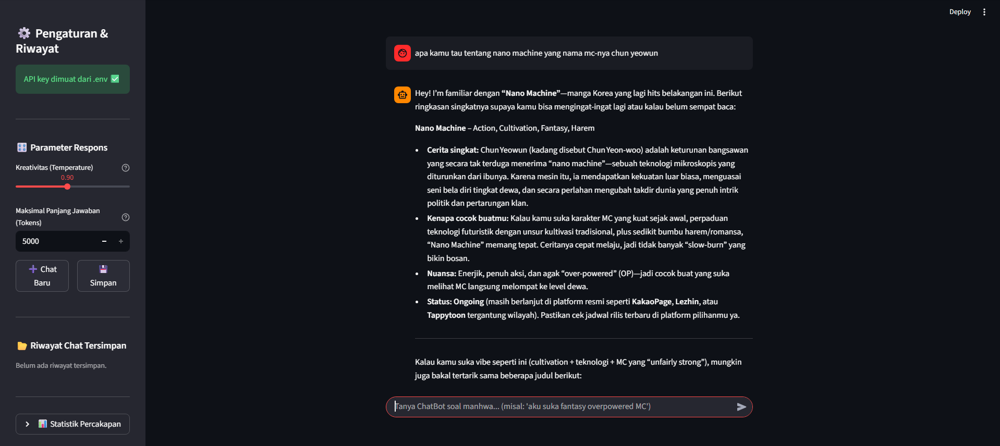

#  ChatBot — Chatbot Rekomendasi Manhwa

Chatbot AI berbasis LLM (via **Groq API**) yang berperan sebagai teman ngobrol yang merekomendasikan manhwa (komik Korea) sesuai genre, mood, dan preferensi pengguna.

---

## 1. Tema & Konsep

**Tema:** Chatbot rekomendasi manhwa.

ChatBot bertindak sebagai teman ngobrol yang:
- Menanyakan preferensi (genre, mood, status cerita ongoing/completed, gaya art) kalau belum jelas.
- Memberi rekomendasi judul manhwa lengkap dengan genre, status, dan sinopsis singkat tanpa spoiler.
- Mengingat konteks percakapan sepanjang sesi (misal kalau kamu bilang sudah baca satu judul,
  ChatBot tidak akan merekomendasikannya lagi di obrolan yang sama).

Chatbot ini tersedia dalam dua bentuk:
| File | Deskripsi |
|---|---|
| `chatbot_console.py` | Versi terminal/console, lengkap dengan streaming |
| `streamlit_app.py` | Versi web sederhana pakai Streamlit |

---

## 2. Cara Mendapatkan GROQ_API_KEY

1. Buka [console.groq.com](https://console.groq.com) dan login (bisa pakai akun Google).
2. Di sidebar, buka menu **API Keys**.
3. Klik **Create API Key**, beri nama bebas (misal `tugas-1`), lalu buat.
4. **Copy key-nya sekarang juga** — key (diawali `gsk_...`) hanya ditampilkan sekali.
5. Simpan key tersebut, jangan dibagikan ke publik.

## 3. Cara Menjalankan Program

### Langkah 1 — Clone / download project ini
```bash
git clone https://github.com/ririthm/manhwa-recommend.git
cd recommendation_manhwa
```

### Langkah 2 — Install dependencies
```bash
pip install -r requirements.txt
```

### Langkah 3 — Setup API key
```
Buka file `.env`, ubah jadi:
```
GROQ_API_KEY=gsk_xxxxxxxxxxxxxxxxxxxxxxxx
```

### Langkah 4 — Jalankan versi Streamlit (web)
```bash
streamlit run streamlit_app.py
```
Browser akan otomatis terbuka di `http://localhost:8501`.

---

## 4. Pengaturan & Fitur Sidebar 

Semua kontrol, pengaturan parameter, dan manajemen riwayat obrolan dapat diakses secara langsung oleh user melalui **Sidebar di sebelah kiri layar**:

| Fitur / Kontrol | Bentuk Interaksi | Fungsi |
| --- | --- | --- |
| **Chat Baru** | Tombol (*Button*) | Menghapus riwayat percakapan saat ini dan memulai obrolan baru dari awal. |
| **Simpan** | Tombol (*Button*) | Menyimpan riwayat obrolan aktif ke dalam berkas JSON (`riwayat_chat_YYYYMMDD_HHMMSS.json`). |
| **Buka Chat Lama** | Daftar Tombol | Memuat kembali riwayat percakapan dari berkas JSON yang pernah disimpan sebelumnya. |
| **Hapus Riwayat** | Tombol (*Button*) | Menghapus berkas riwayat tersimpan tertentu atau membersihkan seluruh riwayat sekaligus. |
| **Kreativitas (Temperature)** | Slider (0.0–1.0) | Mengatur kebebasan/kreativitas AI. Nilai `0.0` menghasilkan jawaban konsisten/pasti, sedangkan `1.0` lebih bervariasi. |
| **Maksimal Panjang Jawaban** | Input Angka (`st.number_input`) | Menentukan batas jumlah *Max Tokens* (100–5000) yang dapat dihasilkan oleh AI dalam satu balasan. |
| **Statistik Percakapan** | Panel Ekspander | Menampilkan rangkuman statistik obrolan aktif (jumlah pesan kamu, balasan AI, dan genre populer yang terdeteksi). |

---

## 5. Contoh Cuplikan Percakapan

```

---

## 6. Struktur Kode

```
recommendation_manhwa/
├── .env
├── .gitignore
├── chatbot_console.py
├── image.png
├── README.md
├── requirements.txt
├── riwayat_chat_xxxxx_xxxxx.json
├── streamlit_app.py
└── __pycache__/
    └── chatbot_console.cpython-310.pyc
```
```

## file `.env`

Tempat menyimpan kunci rahasia `GROQ_API_KEY` dalam format *key-value*. File ini diproses oleh library `python-dotenv` agar API Key tidak ditulis langsung secara terbuka di dalam kode Python.

```

## file `.gitignore`

Panduan untuk Git agar mengabaikan berkas sensitif atau berkas sampah yang tidak perlu diunggah ke repositori GitHub.

```

## file `requirements.txt`

Daftar dependensi pustaka luar yang dibutuhkan lingkungan Python agar aplikasi bisa berjalan tanpa error.

```

## file `README.md`

Berkas dokumentasi lengkap berisi latar belakang proyek, petunjuk instalasi *step-by-step*, penjelasan fitur, panduan perintah, serta tautan aset pendukung.

```

## riwayat_chat_xxxxx_xxxxx.json

Berkas rekaman obrolan yang diekspor oleh sistem. Berisi *array of objects* dengan struktur `{"role": "...", "content": "..."}` yang mencatat interaksi antara pengguna dan AI.

```

## file `image.png`

Berkas tangkapan layar (*screenshot*) tampilan aplikasi yang disematkan ke dalam `README.md` sebagai pratinjau visual.

```

## file `__pycache__/`

Folder sistem internal Python. Otomatis dibuat saat `streamlit_app.py` mengeksekusi instruksi `from chatbot_console import SYSTEM_PROMPT` untuk menyimpan *bytecode* terkompilasi (`.pyc`) agar pemanggilan berikutnya lebih cepat.

```

## 7. Catatan Penggunaan AI

Dalam proses pengembangan chatbot rekomendasi manhwa ini, Generative AI dimanfaatkan sebagai asisten virtual interaktif untuk mengoptimalkan berbagai tahapan proyek.

Pada tahap konseptualisasi dan perancangan, Generative AI membantu dalam melakukan *brainstorming* ide untuk membentuk persona "Rei", merumuskan batasan instruksi (*System Prompt* terpusat), serta merancang logika pengelolaan riwayat percakapan.

Pada tahap pengembangan antarmuka (UI/UX) dan *debugging*, Generative AI membantu menyusun struktur komponen antarmuka Streamlit.

---
